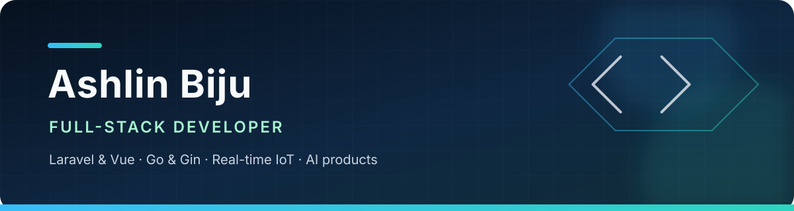

<div align="center">
  
</div>

<h2 align="center">Full-stack developer building APIs, real-time systems, and practical AI products.</h2>

<p align="center">
  I work across Laravel/PHP, Vue and TypeScript, Go/Gin, and Next.js—turning ideas
  into reliable products with clear interfaces, maintainable backends, and automated delivery.
</p>

<p align="center">
  <a href="mailto:ashlinbiju2006@gmail.com">Email</a>
  ·
  <a href="https://github.com/ASHLIN-BIJU?tab=repositories">Repositories</a>
  ·
  <a href="https://www.instagram.com/_itz_me_ashlin">Instagram</a>
</p>

## What I build

- **Backend systems:** REST APIs, authentication, real-time events, data workflows, and service integrations
- **Product interfaces:** responsive dashboards and web experiences with Vue, React, and TypeScript
- **Connected products:** IoT monitoring, automated alerts, AI-assisted tools, and media-processing pipelines
- **Reliable delivery:** tests, linting, GitHub Actions, environment-aware configuration, and deployment workflows

## Core stack

**Backend and APIs**


**Frontend and product**


**Systems and delivery**


## Selected work

<table>
  <tr>
    <td width="50%" valign="top">
      <h3><a href="https://github.com/ASHLIN-BIJU/greenhouse_main">Greenhouse Monitoring System</a></h3>
      <p>Real-time IoT telemetry, threshold alerts, device control, WebSockets, and documented REST APIs.</p>
      <p><code>Laravel</code> <code>Reverb</code> <code>MySQL</code> <code>IoT</code></p>
      <p><a href="https://github.com/ASHLIN-BIJU/greenhouse_main/tree/main/docs">Read the technical documentation →</a></p>
    </td>
    <td width="50%" valign="top">
      <h3><a href="https://github.com/ASHLIN-BIJU/NutriFlow-AI">NutriFlow AI</a></h3>
      <p>AI-assisted meal planning based on dietary targets, budget, preferences, and macro requirements.</p>
      <p><code>Next.js</code> <code>TypeScript</code> <code>Supabase</code> <code>Gemini</code></p>
      <p><a href="https://nutriflowai.vercel.app">Open the live application →</a></p>
    </td>
  </tr>
  <tr>
    <td width="50%" valign="top">
      <h3><a href="https://github.com/ASHLIN-BIJU/To_Do_List">Full-stack Todo App</a></h3>
      <p>Authenticated task management with priorities, filtering, dashboards, automated tests, and CI checks.</p>
      <p><code>Laravel</code> <code>Vue.js</code> <code>Inertia.js</code> <code>TypeScript</code></p>
      <p><a href="https://github.com/ASHLIN-BIJU/To_Do_List/actions">View the automated checks →</a></p>
    </td>
    <td width="50%" valign="top">
      <h3><a href="https://github.com/ASHLIN-BIJU/NOOLU">NOOLU Survey Experience</a></h3>
      <p>A bilingual, keyboard-friendly multi-step survey with responsive motion and Google Forms submission.</p>
      <p><code>React</code> <code>Vite</code> <code>Framer Motion</code> <code>Google Forms</code></p>
    </td>
  </tr>
</table>

## More shipped interfaces

- [ORION Community Portal](https://orion-crew-gecw.vercel.app) — community membership and event experience
- [Power-Supply PCB Workshop](https://design-your-own-power-supply-pcb.vercel.app) — technical event and enrollment site
- [Kerala Restaurant Demo](https://demorestaurant-eta.vercel.app) — responsive restaurant showcase
- [Healthcare Clinic Demo](https://clinic-demo-peach.vercel.app) — patient-focused healthcare landing page
- [Daily Budget Tracker](https://github.com/ASHLIN-BIJU/Daily-Budget-Tracker) — offline-first browser expense tracking

## Current engineering focus

```text
API design · Go and Gin · Real-time applications · IoT automation
AI integrations · CI/CD · Media processing · Product engineering
```

I enjoy working at the point where backend reliability meets a clear user experience—from
designing an API contract to shipping the interface and automating the path to production.

---

<div align="center">
  <sub>Build useful software. Explain it clearly. Keep it reliable.</sub>
</div>
